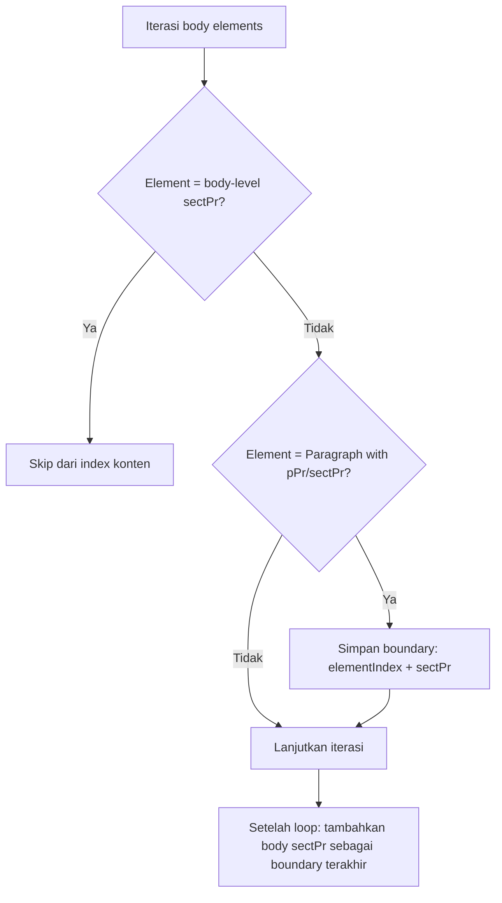
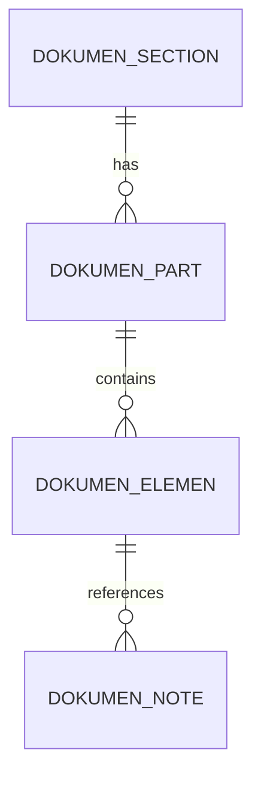

# BAB 4 - EKSTRAKSI DOKUMEN DENGAN OPEN XML SDK

## Pendahuluan Bab
Bab ini menjelaskan bagaimana sistem mengubah dokumen Word (`.docx`) menjadi data terstruktur yang dapat diproses mesin. Fokus utama bab ini adalah proses **extraction**, yaitu proses membaca isi dan format dokumen menggunakan Open XML SDK, lalu menyimpannya ke basis data untuk mendukung proses validasi aturan penulisan.

Untuk pembaca yang belum pernah bekerja dengan Open XML, analogi sederhananya adalah:
1. file `.docx` diperlakukan sebagai paket data (bukan sekadar file teks);
2. setiap bagian penting di dalam paket dibaca satu per satu;
3. sistem membentuk ulang informasi itu menjadi model data yang rapi;
4. model data tersebut dipakai untuk penilaian format dokumen.

Pada proyek ini, proses ekstraksi dipusatkan di `DocxExtractionService` dan dijalankan melalui antrian oleh background worker. Hasil ekstraksi tidak hanya berupa teks, tetapi juga struktur dokumen, informasi section, properti paragraf, properti tabel, properti gambar, numbering list, hingga field otomatis.

Arsitektur ini dirancang agar:
- akurat, karena tetap mempertahankan konteks format;
- robust, karena kesalahan pada satu elemen tidak langsung menggagalkan seluruh ekstraksi;
- traceable, karena data JSON dan raw XML disimpan;
- scalable, karena terintegrasi dengan queue processing.

**Gambar 4.1. Alur Umum Ekstraksi Dokumen di Sistem**

```mermaid
flowchart LR
    A[Upload DOCX] --> B[Antrian Extraction: in_queue]
    B --> C[PdfQueueBackgroundService]
    C --> D[DocxExtractionService]
    D --> E[Section Extraction]
    E --> F[Part Creation: body/header/footer]
    F --> G[Body Element Extraction]
    G --> H[Format Extraction]
    H --> I[Save to DB: section/part/element/format/note]
    I --> J[Extraction completed]
    J --> K[Pipeline lanjut ke validation]
```



Dengan kerangka tersebut, bab ini disusun agar pembaca dapat memahami proses ekstraksi dari level konsep hingga level implementasi.

---

## 4.1 Arsitektur OpenXML dan Struktur DOCX

### 4.1.1 Office Open XML (OOXML) dan Format DOCX
OOXML (Office Open XML) adalah standar berbasis XML untuk dokumen Office modern. Dalam konteks Word, file `.docx` menyimpan konten dalam bentuk kumpulan file XML dan relasi antar file tersebut.

Kenapa ini penting untuk sistem validasi dokumen:
1. konten dan format dapat dibaca sebagai struktur data, bukan pixel;
2. elemen seperti paragraf, tabel, numbering, dan margin dapat diambil secara eksplisit;
3. sistem tidak perlu membuka Microsoft Word untuk membaca dokumen.

Pada praktiknya, proyek ini membaca dokumen menggunakan Open XML SDK dan melakukan translasi ke model internal. Model internal tersebut memisahkan:
- struktur dokumen (`section`, `part`, `element`);
- konten elemen (JSON tree);
- properti format (`dokumen_format_*` tables).

Dengan pemisahan ini, tahap validasi berikutnya dapat melakukan query secara spesifik, misalnya: "cek semua paragraf body pada section tertentu yang line spacing-nya tidak sesuai".

### 4.1.2 Struktur Internal File DOCX
Secara teknis, file `.docx` adalah ZIP package. Di dalamnya terdapat beberapa part penting:
- `word/document.xml` sebagai body utama;
- `word/styles.xml` dan `word/stylesWithEffects.xml` untuk style definitions;
- `word/numbering.xml` untuk list/numbering definitions;
- `word/settings.xml` untuk document-level settings;
- `word/theme/theme1.xml` untuk theme font and color;
- `word/footnotes.xml` dan `word/endnotes.xml` untuk catatan.

Open XML SDK menyediakan akses objek terhadap part-part ini melalui `MainDocumentPart` dan part lain yang terkait.

**Tabel 4.1. Part DOCX dan Kegunaan pada Ekstraksi**

| Part OOXML | Fungsi di Word | Digunakan untuk |
|---|---|---|
| `document.xml` | Konten utama dokumen | Ekstraksi body elements |
| `styles.xml` | Definisi style | Style resolution paragraf/run/tabel |
| `numbering.xml` | Definisi list/numbering | Generate numbering label |
| `settings.xml` | Pengaturan dokumen | Even/odd header, tab stop, compatibility |
| `theme1.xml` | Theme font | Theme font resolution |
| `header*.xml` / `footer*.xml` | Header/footer konten | Part extraction per section |
| `footnotes.xml` / `endnotes.xml` | Catatan | Ekstraksi note + linking ke elemen |

### 4.1.3 Komponen XML yang Menjadi Sumber Data Ekstraksi
Komponen XML utama yang dibaca sistem dirancang agar cocok dengan kebutuhan validasi TA:
- `w:sectPr` untuk page settings per section;
- `w:p` (paragraph) dan turunannya untuk konten teks;
- `w:r` (run) dan `w:rPr` untuk format karakter;
- `w:tbl`, `w:tr`, `w:tc` untuk tabel;
- `w:drawing` / `w:pict` untuk gambar, shape, chart;
- field elements (`w:fldSimple`, `w:fldChar`, `w:instrText`);
- note references (`w:footnoteReference`, `w:endnoteReference`).

Hal penting yang perlu dipahami: sistem tidak hanya mengambil "teks yang terlihat", tetapi juga mengambil "metadata format yang membuat teks itu terlihat seperti sekarang". Ini adalah pembeda utama antara extraction untuk validasi format dan extraction untuk sekadar full-text search.

### 4.1.4 Library Open XML SDK
Library inti yang digunakan adalah `DocumentFormat.OpenXml` (Open XML SDK). Keunggulan library ini untuk proyek:
1. strongly typed API (`Paragraph`, `Table`, `SectionProperties`, dll);
2. aman untuk mode read-only (dokumen sumber tidak berubah);
3. konsisten dengan struktur OOXML sehingga mudah diaudit;
4. mendukung parsing elemen kompleks (numbering, drawing, field).

Di proyek ini, Open XML SDK dipadukan dengan:
- `Newtonsoft.Json.Linq` untuk menyusun JSON content tree;
- EF Core untuk persistence ke MySQL;
- extractor modular (`ParagraphExtractor`, `TableExtractor`, `SectionExtractor`, dll).

Pendekatan ini membuat pipeline mudah dikembangkan. Jika nanti ada kebutuhan menambah extraction untuk elemen baru, pengembang cukup menambah extractor domain baru tanpa harus merombak keseluruhan service.

---

## 4.2 Ekstraksi Section Properties (Pengaturan Halaman)

### 4.2.1 Lokasi SectionProperties dalam Dokumen
Salah satu kesulitan utama pada ekstraksi dokumen Word adalah bahwa section break tidak selalu muncul sebagai elemen top-level yang intuitif. Pada WordprocessingML:
1. section properties bisa berada pada `ParagraphProperties` (`w:pPr/w:sectPr`);
2. section terakhir biasanya berada pada level body (`w:body/w:sectPr`).

Karena itu, `DocxExtractionService` menerapkan strategi indexing khusus:
- loop seluruh body elements;
- skip `SectionProperties` level body dari perhitungan index konten;
- catat paragraf yang mengandung `sectPr` sebagai batas section;
- tambahkan `body-level sectPr` sebagai batas akhir.

**Gambar 4.2. Strategi Deteksi Section**



Strategi ini memastikan pemetaan section terhadap elemen body tetap konsisten, khususnya pada dokumen multi-section yang kompleks.

### 4.2.2 Ekstraksi Ukuran dan Orientasi Halaman
Setelah section boundary ditemukan, tiap `sectPr` dikonversi menjadi record `DokumenSection` melalui `SectionExtractor`.

Properti utama yang diambil:
- page width/height (twips);
- orientation (`portrait` / `landscape`);
- normalisasi width-height agar sesuai orientasi logis.

Mengapa twips dipertahankan:
1. twips adalah unit native Word;
2. konversi baru dilakukan saat validasi/reporting;
3. menghindari akumulasi error rounding.

Untuk pembaca pemula, ingat bahwa `twips` bukan nilai yang "aneh", melainkan unit teknis Word yang justru membuat data lebih presisi.

### 4.2.3 Ekstraksi Properti Section yang Mempengaruhi Pagination
Selain ukuran halaman, sistem juga mengambil properti lain yang berpengaruh pada layout halaman:
- margin (top, bottom, left, right);
- header/footer distance;
- gutter dan gutter position;
- page number format dan start;
- section break type (`nextPage`, `continuous`, dll);
- title page flag;
- odd/even header mode (disinkronkan dari document settings).

**Tabel 4.2. Properti Section yang Diekstrak**

| Kelompok | Properti | Dampak pada Validasi |
|---|---|---|
| Page Size | width, height, orientation | Validasi ukuran kertas |
| Margin | top/bottom/left/right | Validasi margin dokumen |
| Header/Footer | header distance, footer distance | Validasi posisi header/footer |
| Numbering | format, start | Validasi penomoran halaman |
| Section Behavior | break type, title page, odd-even | Validasi layout per section |
| Columns | column count | Validasi format multi-column |

Dengan model section yang lengkap, validasi page settings tidak perlu membaca XML lagi, cukup query tabel `dokumen_section`.

### 4.2.4 Pembentukan DokumenPart (Body, Header, Footer)
Setelah section tersimpan, sistem membentuk part per section:
1. `body` (selalu ada);
2. `header` (`default`, `first`, `even`) jika direferensikan;
3. `footer` (`default`, `first`, `even`) jika direferensikan.

Part dibentuk di `dokumen_part` dan dipetakan via `partMap` agar cepat diakses saat menyimpan elemen.

Keuntungan desain ini:
- konten body tidak tercampur dengan konten header/footer;
- setiap elemen tahu berada di part mana;
- validasi bisa fokus hanya ke `body` saat diperlukan.

Dalam implementasi, saat reference header/footer ditemukan:
1. service membuat record part jika belum ada;
2. ambil `HeaderPart` / `FooterPart` via relationship ID;
3. ekstrak kontennya dengan alur yang sama seperti body.

Ini membuat ekstraksi tetap konsisten lintas part dokumen.

---

## 4.3 Ekstraksi Paragraf dan Konten Teks

### 4.3.1 Struktur Paragraph Element
Paragraf (`w:p`) adalah block element paling umum pada dokumen TA. Dalam sistem ini, satu paragraf menghasilkan:
- satu elemen utama (`dokumen_elemen`) dengan tipe semantik (misal `paragraph`, `h1`, `list-item-*`);
- JSON `content` yang berisi item inline;
- satu record format paragraf (`dokumen_format_paragraf`);
- nol atau lebih format inline (text/drawing/field).

Tipe paragraf ditentukan dengan prioritas:
1. style heading/title/subtitle;
2. numbering efektif (jika list);
3. fallback menjadi `paragraph`.

Pendekatan ini penting karena validasi aturan TA sering membedakan perlakuan untuk judul bab, judul subbab, paragraf isi, dan list item.

### 4.3.2 Ekstraksi Paragraf Properties
`ParagraphFormatExtractor` menyimpan properti paragraf dengan pendekatan **effective properties** (bukan direct-only). Artinya nilai akhir diperoleh dari gabungan:
- default settings;
- style inheritance;
- numbering-level properties;
- direct paragraph properties.

Properti yang diekstrak mencakup:
- list identity (`numId`, `ilvl`);
- spacing before/after/line;
- indent left/right/first line/hanging;
- alignment;
- pagination toggles (`keep_next`, `page_break_before`, dll);
- raw XML properties untuk audit.

**Tabel 4.3. Contoh Properti Paragraf dan Manfaat**

| Properti | Contoh Nilai | Dipakai untuk |
|---|---|---|
| `dfp_jc` | `both` | Validasi align justify |
| `dfp_spacing_line_twips` | `360` | Validasi line spacing 1.5 |
| `dfp_ind_first_line_twips` | `567` | Validasi first line indent |
| `dfp_is_list` | `true` | Klasifikasi list item |
| `dfp_list_ilvl` | `1` | Validasi list level |

Khusus untuk list, sistem menghitung effective hanging indent berdasarkan label numbering dan tab stop setting. Ini mencegah mismatch ketika dokumen menggunakan compatibility mode tertentu.

### 4.3.3 Ekstraksi Konten Paragraf
Isi paragraf diekstrak oleh `ExtractParagraphContentSorted` sebagai array item inline. Jenis item yang mungkin:
- `text`;
- `field`;
- `math`;
- `image`;
- `shape`;
- `chart`;
- `table` (nested di textbox).

Fitur penting yang membuat extraction ini robust:
1. numbering label generation di awal konten list item;
2. caption-aware logic agar nomor caption tidak dobel;
3. run aggregation untuk menggabungkan run berformat sama;
4. nested complex field handling dengan stack;
5. anchored drawing sorting berdasarkan posisi vertikal;
6. recursive textbox extraction.

Pada tahap simpan, `dfp_id` disisipkan ke JSON untuk elemen paragraf/list/heading agar validasi bisa langsung menaut ke format tanpa query inferensi tambahan.

Sistem juga menerapkan error isolation per elemen:
- jika satu elemen gagal diekstrak, elemen lain tetap diproses;
- error log memuat preview XML;
- proses tidak langsung berhenti total.

Ini penting pada dokumen riil yang sering mengandung elemen tidak standar hasil copy-paste dari berbagai sumber.

---

## 4.4 Ekstraksi Run dan Format Teks

### 4.4.1 Struktur Run Element
Run (`w:r`) adalah unit inline yang menyimpan teks dan style karakter. Dalam satu paragraf, run dapat terdiri dari:
- `Text`;
- `TabChar`;
- `Break`;
- `FieldCode` / `FieldChar`;
- `Drawing` / `Picture`.

Karena aturan format TA biasanya mengikat pada font-level, run extraction harus presisi. Misalnya, jika sebagian kata italic dan sebagian tidak, sistem harus tetap bisa membedakan dan melaporkan bagian mana yang tidak sesuai.

Pada implementasi, run dengan signature format identik digabung sebelum disimpan sebagai item `text` untuk mengurangi fragmentasi JSON.

### 4.4.2 Ekstraksi Font Properties
Format karakter disimpan di `dokumen_format_text`. Kolom utama:
- font family (`dftx_font_ascii`);
- font size (`dftx_size_halfpt`);
- bold / italic;
- underline style;
- raw run property XML.

Ekstraksi font menggunakan effective resolution:
1. direct run properties;
2. style inheritance;
3. theme font mapping;
4. language/script-aware resolver.

Mengapa ini penting: pada banyak template resmi, nilai font tidak selalu ditulis langsung di tiap run. Kalau extraction hanya direct-only, hasil validasi akan bias.

### 4.4.3 Ekstraksi Text Styling
Selain font name/size, sistem menangkap style metadata yang relevan untuk validasi:
- bold;
- italic;
- underline.

Untuk field:
- disimpan sebagai item `field` dengan type + value;
- format result text dipisahkan lewat `result_dftx_id`;
- field instruction tetap terlacak melalui format field table.

Pendekatan ini memudahkan validasi elemen seperti:
- page number field di footer;
- sequence field pada caption gambar/tabel;
- cross-reference field.

Dengan demikian, extraction bukan hanya "membaca teks", tetapi "membaca teks beserta mekanisme Word yang membangunnya".

---

## 4.5 Ekstraksi Numbering dan List

### 4.5.1 Struktur NumberingDefinitionsPart
`NumberingDefinitionsPart` berisi blueprint list:
- `AbstractNum`: template numbering;
- `NumberingInstance`: instance nyata (`numId`);
- `Level`: konfigurasi per level (`ilvl`).

Setiap level mendefinisikan:
- start value;
- number format;
- level text pattern (`%1`, `%2`, dst);
- suffix.

Pada dokumen nyata, numbering bisa berasal dari style atau direct paragraph properties. Karena itu sistem menggabungkan keduanya agar hasil label tetap stabil.

### 4.5.2 Ekstraksi Level Properties
Saat generate label list, sistem membaca:
- level efektif;
- level override (jika ada);
- start override;
- restart behavior.

Counter disimpan per `numId` dan per `ilvl`. Artinya, dua list berbeda tidak saling memengaruhi counter walaupun ada di dokumen yang sama.

**Tabel 4.4. Komponen Numbering yang Dipakai**

| Komponen | Fungsi |
|---|---|
| `numId` | Identitas instance list |
| `abstractNumId` | Referensi ke template |
| `ilvl` | Level list (0,1,2,...) |
| `lvlText` | Pola label (`%1.`, `%1.%2`) |
| `numFmt` | Bentuk angka/huruf/roman/bullet |
| `levelSuffix` | Pemisah akhir label (`tab`, `space`) |

### 4.5.3 Ekstraksi Numbering dari Paragraf
Deteksi numbering dilakukan berjenjang:
1. baca direct `numPr` di paragraf;
2. jika tidak ada, cek style-derived numbering;
3. jika ada kasus restart yang masih kompatibel, gunakan continuation state.

`ParagraphExtractor` menyimpan state continuation agar list yang terpotong caption/separator tetap dapat diteruskan dengan benar.

Aturan praktis:
- paragraf netral tidak otomatis reset numbering;
- disabled numbering kosong dapat netral;
- disabled numbering dengan konten nyata akan reset.

Aturan ini sangat relevan untuk dokumen TA yang sering menyisipkan caption atau paragraf pemisah di antara list.

### 4.5.4 Generate Numbering Text
`NumberingExtractor.GetNumberingText` membentuk label final:
- decimal, decimalZero;
- lower/upper letter;
- lower/upper roman;
- bullet.

Untuk bullet, sistem menormalisasi karakter Symbol/Wingdings ke Unicode agar konsisten di hasil data.

Contoh sederhana:
1. `lvlText = "%1.%2"`;
2. counter level-0 = 3, level-1 = 2;
3. hasil label = `3.2` + suffix.

Label hasil ini disisipkan sebagai item `text` pada awal konten list item. Dengan cara ini, validator tidak perlu merekonstruksi label dari nol untuk setiap pemeriksaan.

---

## 4.6 Ekstraksi Tabel

### 4.6.1 Struktur Tabel Elemen
`TableExtractor` mengonversi `w:tbl` menjadi JSON bertingkat:
- table-level format id (`dft_id`);
- daftar row;
- tiap row punya `dftr_id`;
- tiap cell punya `dftc_id` dan konten.

Konten cell dapat berisi:
- paragraf;
- nested table.

Desain ini memungkinkan validasi tabel dari dua sisi:
1. **format/layout** (border, alignment, merge, split behavior);
2. **isi cell** (font, spacing, dan struktur konten).

### 4.6.2 Ekstraksi Table Properties
`TableFormatExtractor` mengekstrak properti tabel:
- style id;
- width dan width type;
- table justification;
- table indentation;
- layout type (`fixed` atau `autofit`);
- table border (JSON);
- floating table position (`tblpPr`);
- raw table properties XML.

Jika style resolver aktif, extractor mengambil effective properties agar hasil sesuai tampilan Word.

### 4.6.3 Ekstraksi Row dan Cell
Pada implementasi aktif, struktur row dan cell disimpan langsung sebagai JSON bertingkat:
- tiap row berisi array `cells`;
- tiap cell berisi array `content`;
- format paragraf atau teks di dalam cell tetap dapat direferensikan melalui `dfp_id` dan `dftx_id` sesuai jenis item.

Index row/column tetap dipertahankan agar traversal nested table dan pembacaan isi sel konsisten.

Penyimpanan terpisah row/cell format memberi keuntungan:
- mudah audit perubahan;
- mudah regression test;
- query validasi lebih fokus.

### 4.6.4 Ekstraksi Konten Cell
Setiap cell diperlakukan sebagai mini-container:
1. jika child adalah paragraf:
   - deteksi tipe paragraf;
   - ekstrak inline content;
   - simpan `dfp_id` untuk paragraf cell.
2. jika child adalah nested table:
   - ekstraksi rekursif dipanggil kembali.

Pendekatan rekursif ini membuat tabel bersarang tetap terwakili akurat di JSON output.

Catatan implementasi: nested table meningkatkan kedalaman struktur data. Karena itu, penautan format ID di setiap level sangat penting agar parser validasi tidak kehilangan konteks.

---

## 4.7 Ekstraksi Gambar dan Drawing

### 4.7.1 Struktur Drawing Elemen
Objek visual modern Word biasanya muncul sebagai `w:drawing`; format lama bisa muncul sebagai `w:pict` (VML).

`DrawingExtractor` mengklasifikasikan konten ke tipe:
- `image`;
- `chart`;
- `shape`;
- `composite`;
- `textbox` (sebagai konten shape).

**Gambar 4.3. Klasifikasi Konten Drawing**

```mermaid
flowchart TD
    A[w:drawing] --> B{Ada blip image?}
    B -- Ya --> C[type=image / composite]
    B -- Tidak --> D{Ada chart reference?}
    D -- Ya --> E[type=chart / shape]
    D -- Tidak --> F{Ada textbox content?}
    F -- Ya --> G[type=shape + textbox items]
    F -- Tidak --> H[type=shape (fallback)]
```

Desain ini membantu menjaga informasi visual tetap terstruktur meski sumber XML sangat beragam.

### 4.7.2 Ekstraksi Image Properties
Format drawing disimpan di `dokumen_format_drawing`, termasuk:
- inline vs anchor;
- graphic type;
- extent (`cx`, `cy`);
- media relationship id;
- anchor dan wrapping JSON;
- preset shape;
- raw drawing XML.

Pada JSON elemen, image biasanya direpresentasikan oleh `rId` plus `dfdr_id`.

Dengan cara ini, sistem bisa menelusuri:
- elemen mana yang menampilkan gambar;
- format posisi/ukuran gambar;
- hubungan gambar ke media part.

### 4.7.3 Ekstraksi Anchor Properties
Objek floating (anchor) tidak selalu berada di urutan baca yang sama dengan urutan XML. Oleh karena itu:
- extractor membaca vertical position (`_sortY`);
- `FloatingElementHelper` mendeteksi elemen floating pada body;
- cluster floating diurutkan berdasarkan koordinat vertikal.

Pendekatan ini bukan simulasi layout sempurna seperti Word renderer, tetapi cukup efektif untuk menjaga urutan logis extraction pada pipeline validasi.

### 4.7.4 Referensi Media dari Package
Dalam pipeline utama saat ini, extraction inti menyimpan referensi media (`rId`) dan format drawing. Strategi ini menjaga ekstraksi tetap ringan, sambil tetap memungkinkan relationship ke image part ditelusuri bila dibutuhkan pada tahap analisis lanjutan.

---

## 4.8 Resolusi Style dan Inheritance

### 4.8.1 Struktur StylesPart
`StylesPart` menyimpan:
- `docDefaults`;
- paragraph/run/table styles;
- relasi `basedOn`.

Pada proyek, style resolution tidak hanya memakai `styles.xml`, tetapi juga:
- `StylesWithEffectsPart`;
- `NumberingDefinitionsPart`;
- `ThemePart`;
- `DocumentSettingsPart` (untuk beberapa behavior).

Ini penting karena dokumen TA hampir selalu berbasis template. Jika style tidak di-resolve secara benar, hasil validasi akan mudah meleset.

### 4.8.2 Algoritma Style Resolution
Algoritma umum yang digunakan:
1. mulai dari `docDefaults`;
2. bangun chain `basedOn`;
3. merge properties parent -> child;
4. injeksi numbering-level properties (jika list);
5. override dengan direct properties elemen.

Untuk tabel, pola serupa diterapkan oleh `TableStyleResolver` dan `TablePropertyMerger`, termasuk conditional style berdasarkan posisi row/cell.

Manfaat praktis:
- output lebih dekat ke tampilan Word aktual;
- lebih tahan terhadap variasi sumber dokumen (template lama/baru).

### 4.8.3 Effective Properties Calculation
Effective properties dihitung untuk:
- paragraf (`EffectiveParagraphProperties`);
- run (`EffectiveRunProperties`).

Lalu dipetakan ke model persistence:
- `DokumenFormatParagraf`;
- `DokumenFormatText`.

**Tabel 4.5. Prioritas Merge Effective Properties**

| Prioritas (rendah -> tinggi) | Sumber |
|---|---|
| 1 | `docDefaults` |
| 2 | Style chain (`basedOn`) |
| 3 | Numbering-level properties |
| 4 | Direct element properties |

Aturan prioritas ini menjamin hasil deterministik. Jika ada konflik nilai, sumber prioritas lebih tinggi akan menang.

### 4.8.4 Theme Font Resolution
Theme font resolver memetakan font reference abstrak (major/minor theme) ke nama font konkret.

Mengapa ini penting:
- beberapa run tidak menulis font name eksplisit;
- tanpa resolver, extraction bisa menghasilkan nilai yang tidak operasional untuk validasi;
- dengan resolver, validator dapat membandingkan font aktual terhadap aturan.

Proyek juga menggunakan language/script-aware resolver agar pemilihan font lebih tepat pada teks non-Latin atau campuran script.

---

## 4.9 Skema Database untuk Hasil Ekstraksi

### 4.9.1 Skema Database untuk Hasil Ekstraksi
Skema hasil ekstraksi dibagi menjadi tiga kelompok:

1. Struktur dokumen:
   - `dokumen_section`
   - `dokumen_part`
   - `dokumen_elemen`

2. Catatan:
   - `dokumen_note`

3. Format:
   - `dokumen_format_paragraf`
   - `dokumen_format_text`
   - `dokumen_format_table`
   - `dokumen_format_drawing`

**Gambar 4.4. Relasi Inti Struktur Hasil Ekstraksi**



Model ini membuat query validasi lebih sistematis, karena struktur dokumen sudah dinormalisasi sebelum aturan dijalankan.

### 4.9.2 Format JSON untuk Konten Elemen
Kolom `delemen_json_tree` berfungsi sebagai container konten semiterstruktur. Contoh:

```json
{
  "dfp_id": 123,
  "content": [
    { "type": "text", "dftx_id": 456, "value": "Contoh teks" },
    { "type": "field", "field_type": "PAGE", "result_dftx_id": 457, "value": "1" }
  ]
}
```

Untuk tabel:

```json
{
  "dft_id": 10,
  "content": {
    "rows": [
      {
        "cells": [
          {
            "content": [
              {
                "type": "paragraph",
                "dfp_id": 40,
                "content": [{ "type": "text", "value": "Isi sel" }]
              }
            ]
          }
        ]
      }
    ]
  }
}
```

Desain JSON ini memberi fleksibilitas tinggi tanpa kehilangan referensi ke tabel format relasional.

### 4.9.3 Sequence dan Ordering
`delemen_sequence` digunakan untuk menjaga urutan proses validasi.

Aturan umum:
- body part: sequence mengikuti urutan extraction setelah floating reordering;
- header/footer part: sequence lokal per part.

Kestabilan ordering dijaga oleh:
1. section mapping berbasis body index non-`SectionProperties`;
2. floating cluster reordering;
3. anchored item sorting menggunakan `_sortY`.

Untuk note linking, sistem memakai dua tahap:
1. map note reference ke sequence saat extraction;
2. map sequence ke `delemen_id` setelah persist.

Pendekatan ini menghindari masalah karena ID database belum tersedia saat traversal XML awal.

### 4.9.4 Optimisasi Penyimpanan
Optimisasi yang sudah diterapkan:
1. pemisahan tabel format dari tabel elemen;
2. penyimpanan JSON + raw XML untuk traceability;
3. error isolation agar extraction tetap berjalan saat elemen anomali muncul;
4. extractor modular agar perubahan lokal tidak merusak pipeline global;
5. integrasi queue untuk proses asynchronous;
6. dukungan `ref_tipe` (`dokumen` / `bab`) agar arsitektur reusable.

Optimisasi lanjutan yang bisa dipertimbangkan:
1. batching persistence pada titik tertentu untuk mengurangi DB round-trip;
2. indexing tambahan untuk query validasi dengan volume tinggi;
3. checksum per elemen untuk incremental re-extraction.

Dengan rancangan ini, sistem telah mencapai keseimbangan yang baik antara akurasi data, keterbacaan arsitektur, dan ketahanan operasional.

---

## Penutup Bab
Bab ini memperlihatkan bahwa ekstraksi dokumen berbasis Open XML SDK bukan hanya proses "membaca teks", melainkan proses rekonstruksi struktur dokumen secara lengkap agar siap divalidasi oleh mesin.

Melalui pipeline `section -> part -> element -> format`, sistem mampu menyimpan:
- konten;
- konteks struktur;
- konteks tipografi;
- konteks pagination;
- dan referensi visual (drawing/media).

Pendekatan ini sangat cocok untuk domain validasi penulisan akademik, karena aturan TA hampir selalu membutuhkan konteks format, bukan hanya isi teks.

Bagi pembaca yang baru mengenal topik ini, inti paling penting dari bab ini adalah:
1. DOCX adalah structured data package;
2. extraction harus memahami inheritance dan relationship;
3. hasil extraction yang baik menentukan kualitas validasi;
4. desain database dan JSON harus saling melengkapi.

Dengan fondasi tersebut, modul validasi di tahap berikutnya dapat bekerja lebih akurat, terukur, dan dapat dipertanggungjawabkan secara ilmiah.
